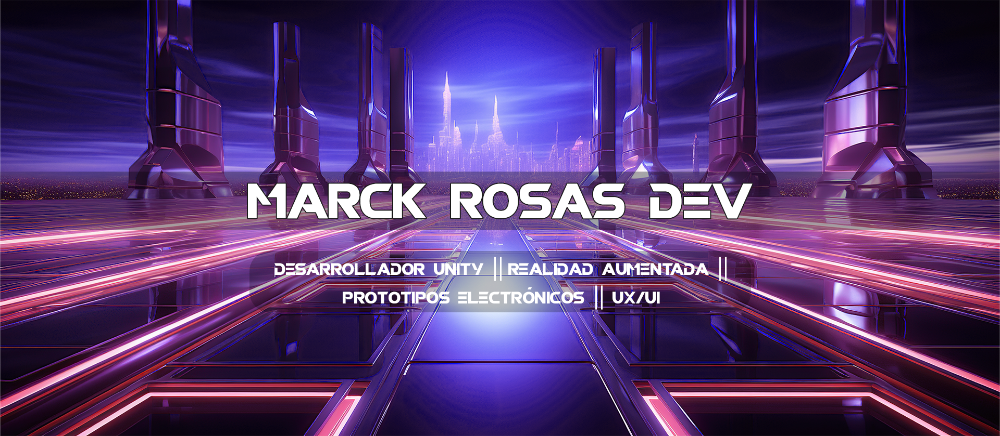

<h1 align="center">¡Hola a tod@s!, Soy: </h1>

<h3 align="left">Contacta conmigo </h3>

**MarckRosasDev**  es ingeniero Electrónico con Maestría en Computación Aplicada. Se ha desempeñado en diversos puestos de trabajo, desde mantenimiento a equipo de cómputo, hasta desarrollo de videojuegos y aplicaciones que hacen uso de Realidad Aumentada con fines de investigación académica.

**Mi expericia :**

- 🎮 Desarrollo de aplicaciones que hacen uso de la realidad Aumentada para dispositivos móviles con S.O. Android.
- 🤖 He construido prototipos electrónicos funcionales para su aplicación en diversas ramas.
- 📱 He diseñado interfaces de usuario intuitivas y atractivas para las aplicaciones ue he desarrollado.

<h3 align="left">Tecnologías</h3>

